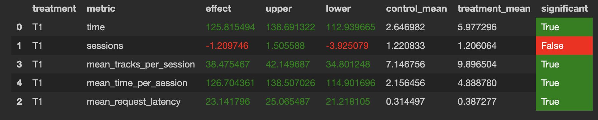

# Домашнее задание № 1

Мое решение заключается в модификации решения с семинара 4 (Contextual).
Вместо фолбека на рандомный рекомендер - фолбек на StickyArtist. 
Мой реокмендер находиться - botify/botify/recommenders/hw.py. 
Все данные исвользуются с 4 семинара.
Запускала симулятор командой - python sim/run.py --episodes 1000 --config config/env.yml multi --processes 4

Результат AB эксперимента для Contextual + Random

Результат AB эксперимента для Hw + Random

Из этих эксперементов видно что hw-recommender оказался лучше чем recommender с семинара 4 по метрике mean_time_per_session