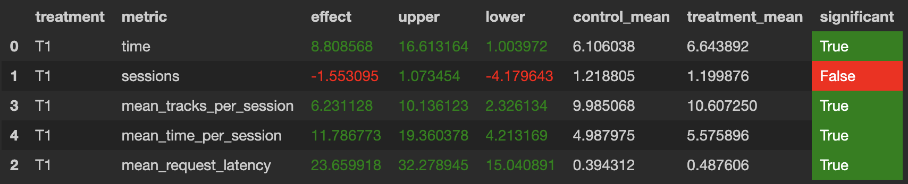

# Домашнее задание № 1

Мое решение заключается в модификации решения с семинара 4 (Contextual).
Вместо фолбека на рандомный рекомендер - фолбек на Indexed. 
В том числе фолбек на Indexed если время прослушивания предыдущего трека меньше 0.12.
Последующие рекомендации будут не лучше.
Мой реокмендер находиться - botify/botify/recommenders/hw.py. 
Все данные используются с 4 семинара.
Запускала симулятор командой - python sim/run.py --episodes 1000 --config config/env.yml multi --processes 4

АВ-тест: в контроле показыван CONTEXTUAL, а в тритменте - мой рекомендер

Из этого эксперимента видно что получившийся рекомендер лучше чем CONTEXTUAL.
